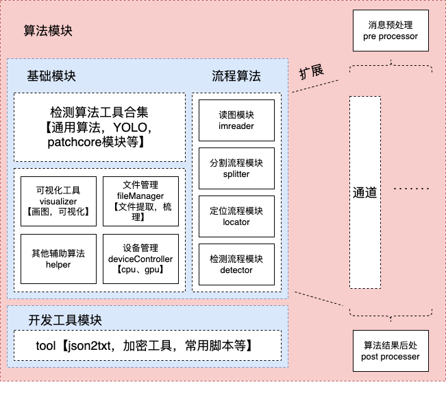

# UnifiedDectectionRobot

此项目为了统一车顶，车侧，车底三方代码。




```
部署文件夹
    | --- 后端 worker/
    | --- algo_worker.py # 接入后端请求的方式，每个车型的主流程接入口
    | --- uni360detection # 基础算法模块
		| --- global_settings.py # 全局配置，如是否可视化，保存路径等
        | --- base/ # 流程
        | --- train_library/ # 车型大全
        | --- ...
    | --- CR300AF # 车型
        | --- local_params.yaml # 参数，通道参数，模型参数
		| --- local_settings.py # 本地配置，如是否可视化，保存路径等
        | --- template/ # 模版
            | --- 1/ or channel1.json or channel1.yaml 
            | --- 2/ or channel2.json or channel2.yaml 
            | --- ... 
        | --- weights/ # 模型权重
            | --- xxx.pth/pt
            | --- ...
        | --- detector.py # optional[继承base/locator.py] 补充一些callback检测函数
        | --- locator.py # optional[继承base/locator.py] 针对特殊通道，修改
        | --- main.py # 当前车型的主流程
        | --- ... 
    | --- CRH1A-A
        | --- local_params.yaml
        | --- template/
            | --- channel1.json or channel1.yaml 
            | --- channel2.json or channel2.yaml 
            | --- ... 
        | --- weights/
            | --- xxx.pth
            | --- ...
        | --- detector.py [继承base]
        | --- locator.py [继承base]
        | --- main.py
        | --- ... 
```

# 参考
细节参考[点击这里](http://doc.py-star.com/docs/b)


