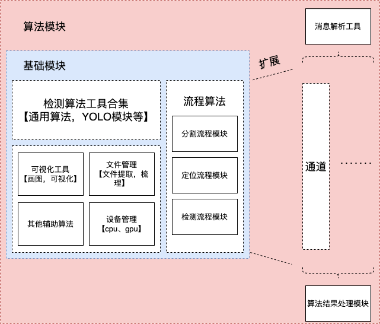

# UnifiedDectectionRobot

此项目为了统一车顶，车侧，车底三方代码。




- train_library 的设计就是包含所有车型基本信息
    - 大车型系列, major_train_code，如CR400AF， CRH1A，用 "名称+.yaml" 保存 
    - 小车型系列或者自车型, minor_train_code, 如CR400AF-A，CRH1A-A， 在大车型系列下面保存。
    - 每个子车型包含该车型的长，宽，高，车厢连接处与总长的百分比

```yaml
CRH1A-A: 
  span: 213.5
  width: 3.328
  height: 4.040
  num: 8
  head_car_len: 26.95
  midd_car_len: 26.6
  cutpoints: [0.     , 0.12623, 0.25082, 0.37541, 0.5    , 0.62459, 0.74918,
       0.87377, 1.     ]

```

- 为了之后方便替换AB车型局部项点，车厢的模版标注分为4个级别
```
    - channel, 以通道为基准 （文件夹）
        - carriage，以车厢为最大框 （车厢.json）
            - region，车厢局部件  
                - detail，零部件

----------
label命名2要素： 零部件名称/个数
标注方式：
1、 检测是否包含n个单元对象
2、 检测是否包含n个多元对象
```


- 数据的储存方式
```
    客户, 如主导，华兴
    |--- 地点，如三亚，或者未知的时候用客户公司所在地
        |-- 拍摄棚子, A，B，C，【README.md 说明】
            |--- 车型, 如CR400AF，300AF
                    |--- 时间戳或者uid
```


- 根据设定一个棚子可能会有多个车型，每个车型需要的模型，还有参数不一样， 每个车型需要部分替换代码，如detector.py需要细节填充。

```
部署文件夹x
    | --- uni360detection
        | --- base/
        | --- train_library/
        | --- ...
    | --- CR300AF
        | --- local_config.yaml
        | --- template/
            | --- channel1.json or channel1.yaml 
            | --- channel2.json or channel2.yaml 
            | --- ... 
        | --- weights/
            | --- xxx.pth
            | --- ...
        | --- detector.py [继承base]
        | --- locator.py [继承base]
        | --- main.py
        | --- ... 
    | --- CRH1A-A
        | --- local_config.yaml
        | --- template/
            | --- channel1.json or channel1.yaml 
            | --- channel2.json or channel2.yaml 
            | --- ... 
        | --- weights/
            | --- xxx.pth
            | --- ...
        | --- detector.py [继承base]
        | --- locator.py [继承base]
        | --- main.py
        | --- ... 
    |           
```


